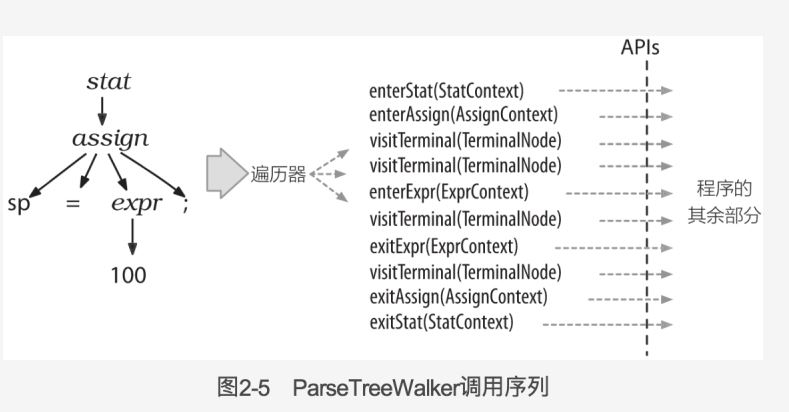
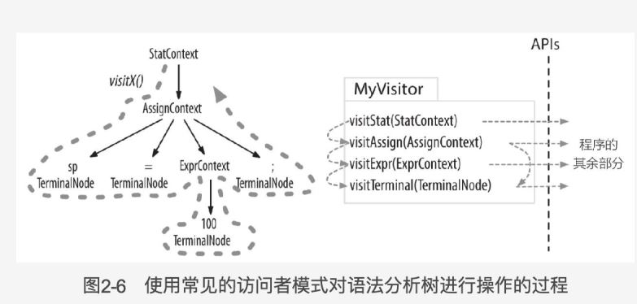

# visitor and listener

## 语法分析树监听器

antlr为每个语法文件都生成一个listener的类，这个类中，对每条语法规则，都有对应的enter和exit方法，当遍历器访问到相应规则的时候，会调用这条规则的enter方法，访问完全完毕以后，再调用exit方法，其实就是语法树的`深度优先遍历`的过程

## 语法分析树访问器

需求是这样的，listener是深度优先的全树遍历，有时候，我们希望自己控制语法分析树的遍历过程，即通过显式的方法调用来控制访问过程

