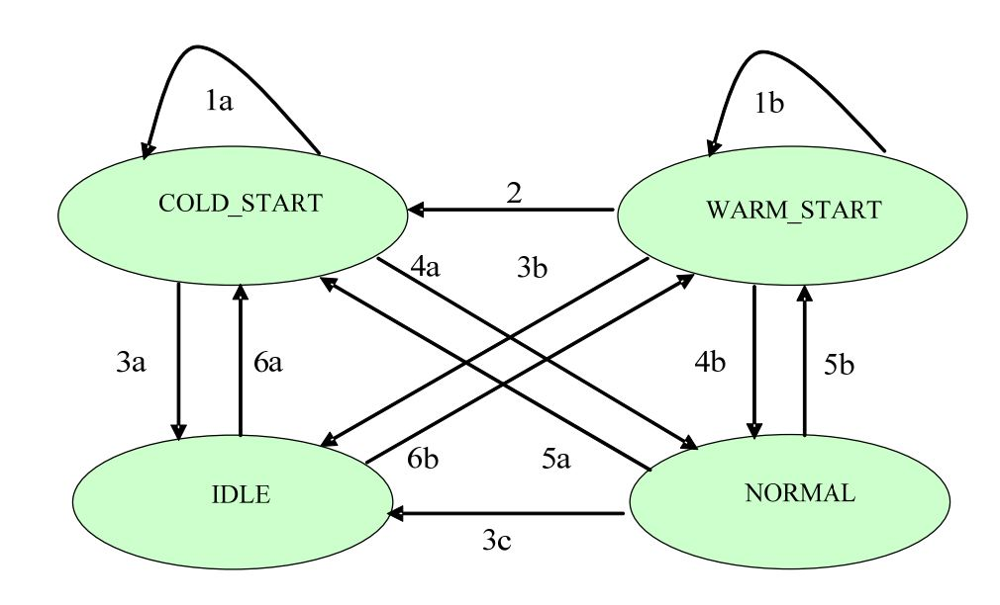
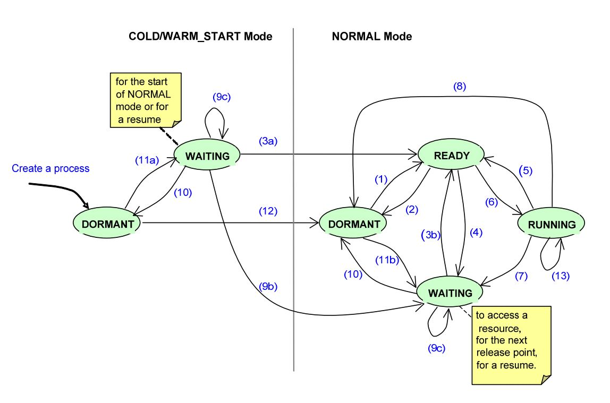

# system overview

## system functionality

在核心模块层面，OS负责分区管理和通信，在分区层面，OS负责进程管理和进程的通信。所以从功能来说，OS是多层面的。在任意时间，模块的状态有三种：
- initialization
- operational
- idle

这三种状态可以相互转换，启动时，模块位于初始化状态。完成后进入运行态直到关闭；健康管理模块可以指定模块重新初始化或进入空闲状态。

### partition management

分区是ARINC 653的核心概念，分区由两个层面，空间的分区和时间的分区。分区拥有不同的临界区去执行相同的模块，而不互相影响。

OS的核心模块有一个部分，来强制分区和执行分区管理，这个部分应该是独立的，不受任何分区中软件失败的影响的。

分区是一个固定循环顺序运行的，OS将运行时间划分为小的时间片，简单的说，分区是时间片轮转的方式运行的。

#### partition attribute

- identifier 分区唯一标识
- name
- memory requirement 包括独立的进程栈空间，
- partion period 启动的时间间隔，（理解）如果分区内的进程period是不相同的，那么分区的peroid就是使用频率最高的进程的peroid。如果没有周期性进程，那就使用最低的执行频率。
- partion duration 在一个peroid内，分区需要的运行时间
- Inter-Partition Communication Requirements 
- Partition Health Monitor Table 

#### partition control

OS进入operatioinal转态时使用分区机制，相关的对象也在分区初始化的时候创建，随后，分区进入NORMAL模式，当前分区的运行模式和其他分区的模式是独立的。

关于分区调度模块：
- 从开发者视角来说，调度单元就是一个分区
- 分区没有优先级
- 分区调度算法是实现设计好的，时间片轮转循环的调度，只由配置表来进行配置。在每个主时间片中，至少有一个分区窗口分配给一个分区。 

关于分区的模式：
- IDLE
- NORMAL
- COLD_START： 分区正在进行初始化
- WARM_START： 分区正在进行初始化，和冷启动类似，但是初始环境不一样，无需拷贝代码到RAM

COLD_START和WARM_START：热启动进程内容在内存中会保留，冷启动不会，故而在冷启动中不允许进程中断，因为无法恢复现场。他们的状态可以互相转换，转换的因素有：电源中断，硬件重新初始化，健康监控，或者SET_PARTITION_MODE服务

### Process Management

fixed attributes:
- name
- entry point: starting addr of the proc
- stack size: 每个进程都有独立的栈空间，每个进程的栈空间大小可以是不同的
- base prioriy
- peroid: 激活后的运行时间片
- time capacity: 进行运行完成应该花费的时间
- deadline: hard or soft

variable attirbutes:
- current proirity
- deadline time
- process state: dormant, ready, running, or waiting

#### Process Control

进程创建和初始化是在分区初始化时进行的。

Process states:
- Dormant: 休眠态，进程未被分配CPU及运行资源，但没有被终结
- Ready: 进程已被分派运行资源，只等CPU
- Running
- Waiting: 进程没有被分配运行资源，是因为在等待特定的条件去触发。

#### Process Scheduling
1. 调度单元本身就是一个高级进程，复杂分区内CPU资源的分配
2. 每个进程都有一个当前优先级
3. 进程的调度是基于优先级的，对于相同优先级的进程，选择等待时间最长的进程去执行
4. 同时支持周期和非周期的进程调度
5. 分区内的所有进程共享分区的资源

进程需要提供进程优先级锁，使用进程的优先级锁时，同一分区的进程在访问临界区或者有共享资源时，操作系统的进程优先级重新调度或被保护起来。使用LOCK_PREEMPTION，UNLOCK_PREEMPTION服务控制。同时，保护锁只在本分区内有效。

### Time Management

进程的deadline设定为current time + time capacity，

### Interpartition Communication

分区间通信是通过message来实现的。消息就是一段有确定长度的连续内存，其接受方也是一个分区。消息的传送就是讲内存中的内容通过通信网络从发送方拷贝到接收方。

连接分区间进行通信的工具是channel，分区通过端口来连接channel，而消息传送也就是端口和端口间的传送。

#### Sampling Mode

这个模式的特点是消息没有排队。消息在发送端口的状态有两种，要么通过管道发送出去，要么被后来的消息覆盖掉，取决于那种情况先发生。而对于接受端口，消息会一直存留，直到下一个消息到达被覆盖掉，故而在采样模式下，目标端口只能读到最近消息。还有，到达目标端口的消息一定是完整的消息。

#### Queuing Mode

这个模式的特点是不允许覆盖，发送端和接收端都有一个缓冲区，用来存储消息。消息的传送和接收都是FIFO

#### Port Attribute

- port name
- mode of transfer
- direction
- max message size
- max number of message
- refresh peroid: 在sampling mmode时使用，来控制消息以特定的速率到达接收端口。
- port mapping: port和物理通信媒体的映射，
