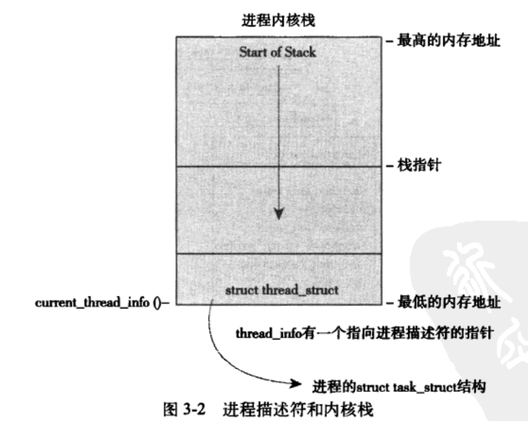
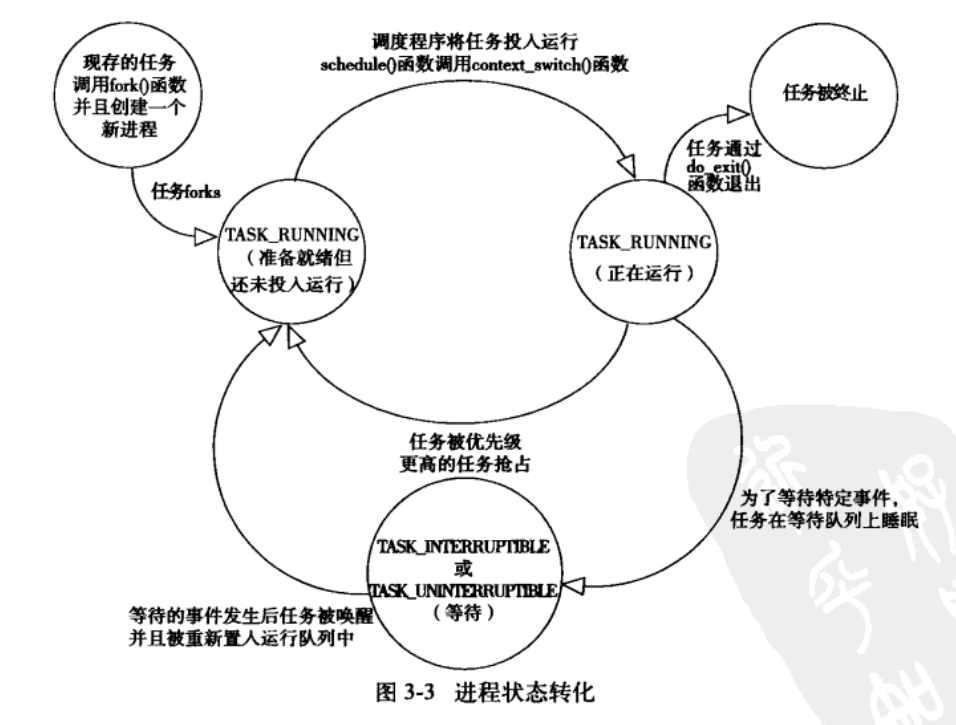
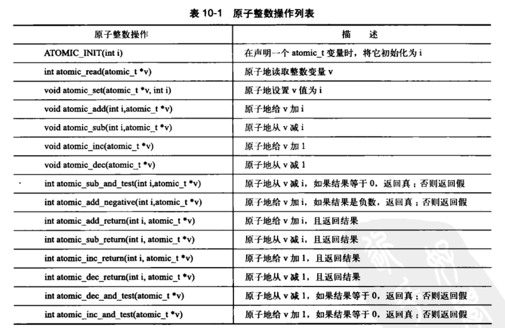
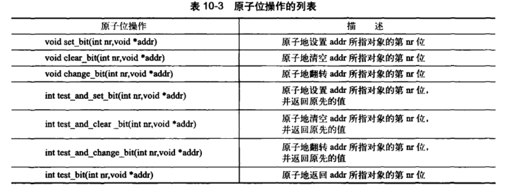
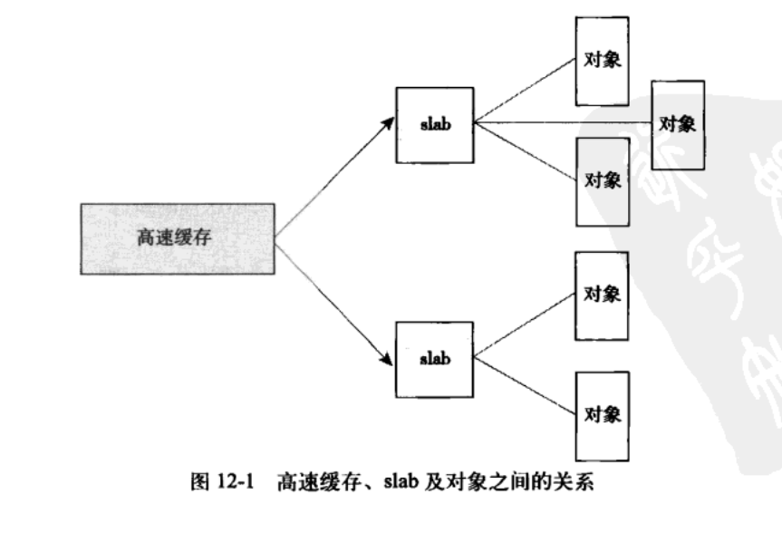

# Linux Kernel

## 进程管理

内核将进程的列表存放在任务队列(`task list`)的双向链表中。linux 通过slab分配器分配task_struct的结构，这样达到对象复用和内存着色的的目的。早期的linux，task_struct结构在内核栈的尾端，为了方便定位。有了slab以后，只需要创建一个`thread_info`结构在栈中即可。



### 进程状态

 - task_running
 - task_interruptible
 - task_uninterruptible
 - task_traced
 - task_stopped



linux中所有进程都是init(pid=1)的进程的子进程，而且在task_struct中都有一个指向其父进程的指针，还有子进程的链表。可以通过这个继承体系，遍历系统中的所有进程。

### 进程的创建

一般的系统创建进程是在新的地址空间中创建进程->读入可执行文件->运行。Linux用另一种方法，即`fork + exec`。Linux的fork使用copy-on-write技术实现，fork时内核并不复制整个进程地址空间，而是让父子进程共享同一个拷贝，只有需要写入的时候，数据才会被复制，从而使各个进程拥有各自的拷贝。fork的实际开销就是`复制父进程的页表以及给子进程创建唯一的进程描述符`。

#### fork

调动关系： fork -> clone -> do_fork -> copy_process
1. 调用dup_task_struct创建新的内核栈，thread_info, task_struct与父进程相同
2. 检查创建进程后，进程数量没有超过限制
3. 子进程将task_struct的一些成员清零或者设为初始值
4. 状态设为task_uninterruptible，确保不会被调度运行
5. 更新task_struct的flag成员
6. 分配一个新的pid
7. 拷贝父进程打开的文件，信号处理函数，地址空间等
8. 返回一个指向子进程的指针

### 线程

从内核角度来说，并没有线程的概念，把线程当成进程来处理，只是和其他进程共享地址空间。创建线程时也是调用`clone`，制定的参数如下：
```c
// thead
clone(CLONE_VM | CLONE_FS | CLONE_FILES | CLONE_SIGHAND, 0);
// fork
clone(SIGCHLD, 0);
// vfork
clone(CLONE_VFORK | CLONE_VM | SIGCHLD, 0);
```
其实和fork差不多，知识他们共享地址空间，文件系统资源，文件描述符和信号处理程序。

## 进程调度

### 优先级

linux调度有优先级的概念，第一种时nice值，nice值指的是对其他进程的友好程度，nice值越高，调度的时间就越短。nice值可以代表时间片的比例或者绝对时间值（有负值）。另一种是实时优先级，可配置，实时进程优先级高于普通进程。

### 时间片

linux的时间片不是固定的，IO消耗型的进程希望获得更短的时间片，有利于请求的响应，处理器消耗型的进程希望获得长的时间片，有利于他们的cache命中。CFS调度器是将处理器的使用比例划分给了进程，时间片是和系统负载有关的，比例会受nice值的影响，高nice值进程权重低，丧失一部分处理器使用比。

linux系统是抢占式的，是否抢占取决于优先级和时间片。CFS的抢占时机取决于新的可运行程序消耗了多少处理器的使用比，如果消耗的使用比比当前进程小（也就是它被运行的少了）则抢占，否则推迟。

### UNIX调度的问题

1. nice单位值映射到处理器绝对时间是有缺陷的，假设0对应100ms,则+20对应5ms,这样，如果是两个低nice值的进程的调度，每个5ms就有一次调度，代价高。
2. nice 0,1是100ms和95ms，但是18,19却是10ms和5ms，比例失调。

### CFS公平调度

主要思想是让每个进程都能获得处理器调度的1/n的时间。

CFS允许每个进程运行一段时间，循环轮转，选择最少运行的进程作为下一个可运行的进程，将nice值作为一个运行权重（只和nice的相对值有关），不直接和时间片挂钩。CFS中每个进程最小运行时间片称为粒度，默认是1ms，轮转所有进程的时间段就是目标延迟时间。

### Linux调度实现

#### 时间记账

调度器实体结构作为成员变量，嵌入在进程描述符struct task_sturct中。`vruntime`是一个加权的运行时间，和定时器节拍无关，（可以理解为运行的进度？？），使用该变量来记录一个程序到底运行的多长时间以及还要运行多久。完美的任务调度中，vruntime应该是一致的，所以linux在调度的时候，选择最小vruntime的任务来运行。

CFS使用`红黑树`来组织可运行进程队列，可以迅速找到最小的vruntime值。


## 内核同步方法

### 原子操作

原子整数操作：只能对atomic_t类型的数据进行处理。使用这种类型一是确保原子操作只与这种特殊的数据操作，另一个是确保编译器不对数据进行访问优化。
```C
typedef struct {
    volatile int counter;
} atomic_t;

atomic_t v;
atomic_t u = ATOMIC_INT(0);

atomic_set(&v, 4);
atomic_add(2, &v);
atomic_inc(&v);
atocic_read(&v);

// 64bit
typedef struct {
    volatile long counter;
} atomic64_t;
```
原子操作表：


原子位操作：原子位操作函数对普通的内存地址进行操作，参数是一个指针和一个位号。
```C
unsigned long word = 0;

set_bit(0, &word);
set_bit(1, &word);
clear_bit(0, &word);
```
原子操作表：


### 自旋锁

自旋锁和互斥锁不太相同，自旋锁在没有获得锁时会一直忙循环-旋转-等待锁重新可用，而不会将进程睡眠。
```c
DEFINE_SPINLOCK(mr_lock);
spin_lock(&mr_lock);
// do sth
spin_unlock(&mr_lock);
```

自旋锁可以使用在中断处理程序中（不能使用信号量，会导致睡眠），在获取锁之前，一定要关中断，负责一旦中断处理程序也想获得这个锁，就会有请求保持的情况发生，导致死锁。内核提供了请求锁同时禁止中断的函数
```c
DEFINE_SPINLOCK(mr_lock);
unsigned long flags;
spin_lock_irqsave(&mr_lock, flags);
// do sth
spin_unlock_irqrestore(&mr_lock, flags);
```

### 信号量

信号量是一种睡眠锁。
- 适用于锁长期持有的情况，否则，调度的时间可能和锁持有的时间差不多。
- 只能在进程上下文中获取，在中断上下文中不能获取
- 可以在持有信号量时睡眠（持有自旋锁关中断）
- 占有信号量的同时不能占用自旋锁

关于自旋锁和互斥锁

|需求 | 加锁方法|
|:--:|--|
|低开销枷锁|自旋锁|
|短期锁定| 自旋锁 |
| 长期加锁 | 互斥锁 |
| 中断上下文加锁 | 自旋锁 |
| 持有锁需要睡眠 | 互斥锁 |

### 顺序锁

通常简称seq锁，实现主要依靠一个序列计数器，当数据被写入时，会得到一个锁，并且序列值会增加，在读取数据之前和之后，序列号都会被读取，如果读取的序列号相同，则说明读操作过程中没有被写打断。如果读取的值时偶数，表明写操作没有发生（锁初值为0，写锁会使其变成奇数，释放时再变成偶数）
```c
seqlock_t mr_seq_lock = DEFINE_SEQLOCK(mr_seq_lock);
write_seqlock(&mr_seq_lock);
// write lock
write_sequnlock(&mr_seq_lock);

// read
unsigned long seq;
do {
    seq = read_seqbegin(&mr_seq_lock);
    // read
} while (read_seqretry(&mr_seq_lock, seq));
```
seq锁适合一下场合：
- 数据存在很多读者
- 写者很少
- 写者虽然少，但是希望写优先于读
- 数据很简单，无法使用原子操作

## 内存管理

```c
struct page {
    unsigned                flags;
    atomic_t                _count;     // 引用计数
    atomic_t                _mapcount;
    unsigned long           private;
    struct address_space    *mapping;   // 被页缓存使用
    pgoff_t                 index;
    struct list_head        lru;
    void                    *virtual;   // 页的虚拟地址
};
```

### 区

有些页位于特定的物理地址上，不能将其用于一些特定的任务，所以，内核吧页划分为不用的区。一般是处理一些硬件存在的缺陷：
- 一些硬件只能用特定的内存地址来执行DMA（直接内存访问）
- 一些体系结构物理寻址范围比虚拟地址范围大

故而，Linux使用四个区：
- ZONE_DMA-包含的页只能用来执行DMA操作(0-16MB for x86)
- ZONE_DMA32-可以用来执行DMA操作；但是这些页面只能被32位的设备访问。
- ZONE_NORMAL-能被正常映射的页
- ZONE_HIGHEM-包含高端内存，期中的页不能永久的映射到内核地址空间(>896MB for x86)
  
| 区 | 描述 | 物理内存 |
| -- | -- | -- |
| ZONE_DMA | DMA使用的页 | <16MB |
| ZONE_NORMAL | 正常可寻址的页 | 16 ~ 896MB |
| ZONE_HIGHMEM | 动态映射的页 | > 896MB |

页分配有两个函数：
```c
// alloc
struct page * alloc_pages(gfp_t gfp_mask, unsigned int order);
unsigned long __get_free_pages(gfp_t gfp_mask, unsigned int order);
// free
void __free_pages(struct page *page, unsigned int order);
void free_pages(unsigned long addr, unsigned int order);
```

前者返回page结构体，后者返回第一页的逻辑地址。都是分配 `1 << order` 个连续页。

### kmalloc or vmalloc?
两个细粒度的内存分配函数：`kmalloc` 和 `vmalloc`， 前者分配的内存在物理上是连续的，后者分配的是连续的虚拟地址空间，物理上不一定连续。内核使用时一般采用kmalloc，只有当需要连续的大块内存的时候，采用到vmalloc，通过修改页表，达到逻辑上连续的目的，但是过多这样的数据可能会引起TLB的抖动

### slab层

分配和释放内存对于内核是特别频繁的操作，为了便于回收和利用，一般会用到空闲链表，需要时从链表中去除一块内存，回收时再释放到链表中。但是内核是不知道链表的存在的，内存紧缺时，无法通知其收缩缓存释放一些内存出来。

 有几个分配的原则：

 - 频繁使用的数据结构应当缓存
 - 频繁分配和回收必将导致内存碎片问题
 - 回收的对象可以立即用于下一次分配
 - 分配器直到对象大小，页大小，和总的高速缓存
 - 部分缓存专属于单个处理器
 - 对存放的对象进行着色，防止多个对象映射到相同的高速缓存

#### slab层的设计

slab层把不同的对象划分为所谓的高速缓存组，每个高速缓存组都存储不同的对象，每种对象对应一个高速缓存，例如一个高速缓存用于存放进程描述符，另一个存放索引节点对象。kmalloc接口也是建立在slab层之上，使用通用高速缓存。

高速缓存又被划分为slab，slab由一个或多个连续的物理页组成，每个slab都包含一些对象成员。



每个高速缓存都使用`kmem_cache`结构表示，包括三个链表:`slabs_full, slabs_partial, slabs_empty`。链表中包含所有的高速缓存中的slab。

```c
struct slab {
    struct list_head    list;       
    unsigned long       colouroff;  // slab着色的偏移
    void                *s_mem;     // slab中的第一个对象
    unsigned int        inuse;      // 已分配对象数
    kmem_bufctl_t       free;       // 第一个空闲对象
}

static inline void *kmem_getpages(struct kmem_cache *cachep, gfp_t flags) {
    void *addr;
    flags |= cachep->gfpflags;
    addr = (void*)__get_free_pages(flags, cachep->gfporder);
    return addr;
}
```

高速缓存分配器不会频繁的申请和释放页，只有当内存紧缺，或高速缓存被撤销时才会显式的释放页。

```c
/*
size: 对象大小
align: slab内第一个对象偏移
ctor: 高速缓存构造函数，一般为NULL
*/
struct kmem_cache *kmem_cache_create(const char *name, size_t size, size_t align, unsigned long flags, void (*ctor)(void *));

/*
高速缓存中所有slab都应该为空
在调用该函数过程中，不在访问该高速缓存
*/
int kmem_cache_destroy(struct kmem_cache *cachep);

void *kmem_cache_alloc(struct kmem_cache *cachep, gfp_t flags);

void kmem_cache_free(struct kmem_cache *cachep, void *objp);
```
