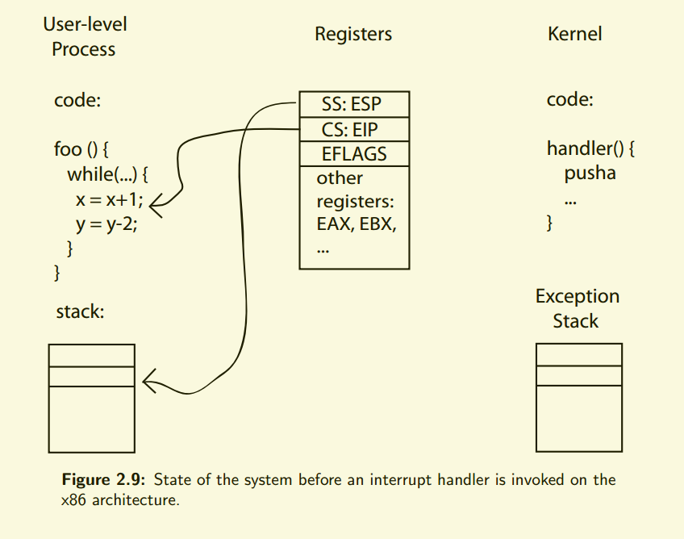
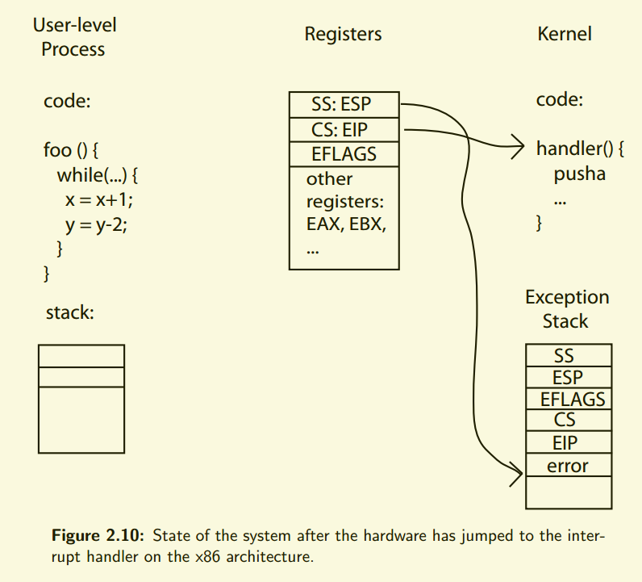
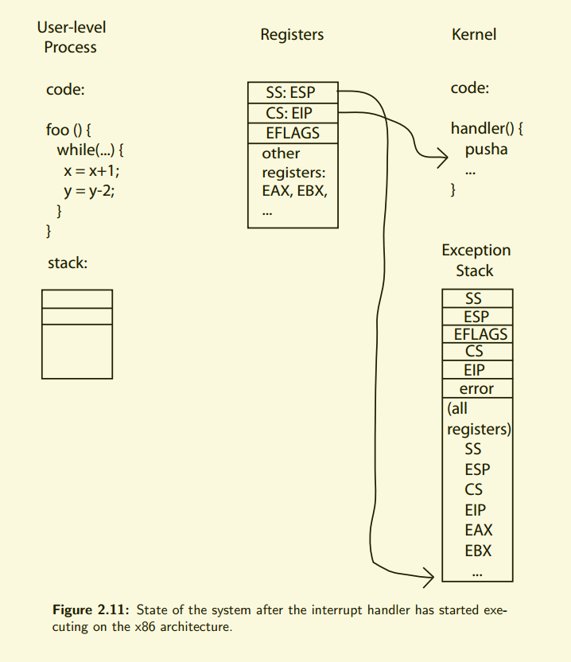
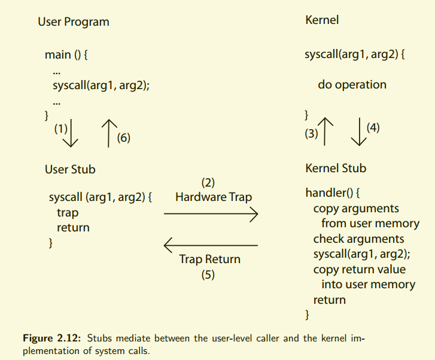

## Kernels and Processes

### Kernel to user mode

1. new process
2. resume after an exception, interrupt or system call
3. switch to different process
4. user-level upcall

### Mode switch on x86

user level process is running, exception or traps occurs:

- save three key values. `stack pointer (ss && esp)`, `execution flags (eflags)` and `instruction pointer (cs && eip)`.
- switch onto the kernel exception stack.
- push three key values onto the new stack.
- optionally save error code.
  -   save rest of the interrupted process's state (`pushad`)
- invoke the interrupt handler.
- resume the interrupted process
  - pops all the saved registers on the stack (`popad`)
  - pops the error code
  - execute x86 `iret`

*when os returns from an exception, the exception handler modifies the program counter stored on the stack to prevent the instruction recurs (or rerun the instruction that caused the exception)*

### System calls

We melt syscall 2 views -- the user program calling the system call, and the kernel implementing the system call -- with a pair of stubs. or system call stubs.

The kernel stub has four tasks:

- Locate system call argument 
  - arguement to a system call are stored in user memory
- Validate paremoters
- Copy before check
- Copy back any result

